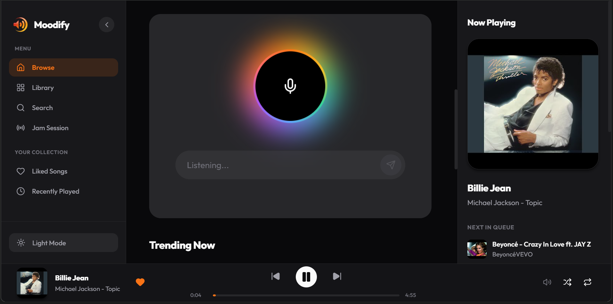
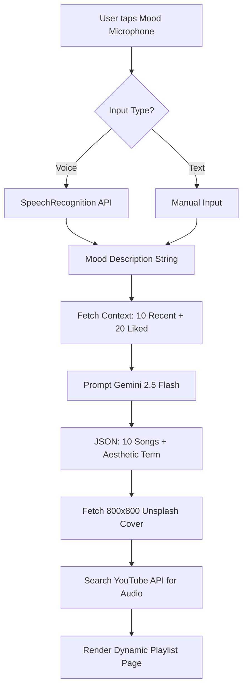
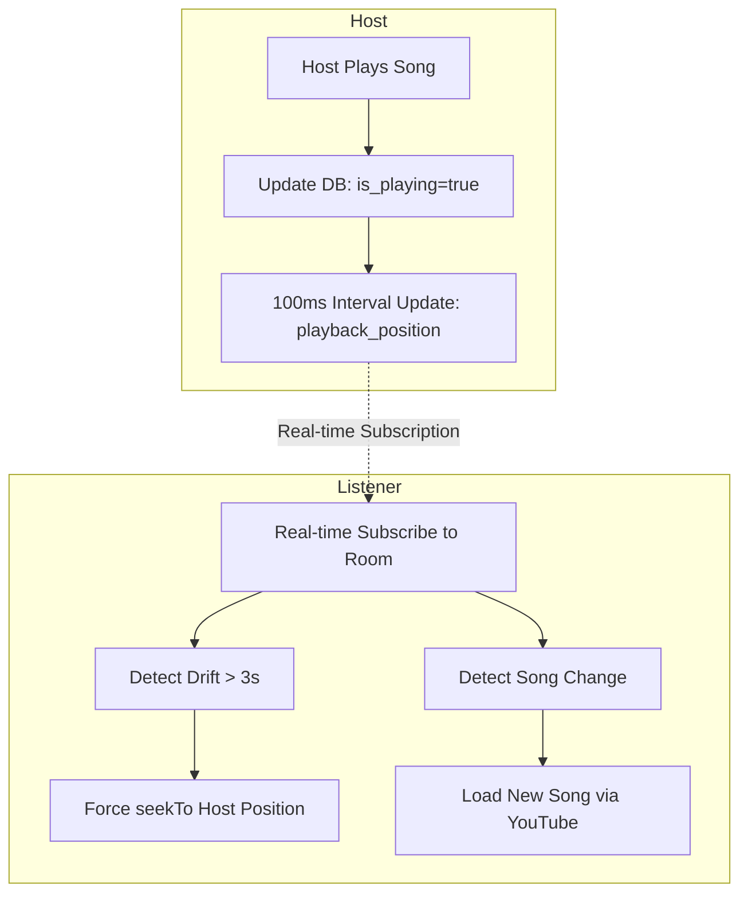

# 🎵 Moodify: AI-Native Social Music Platform

Moodify is a next-generation music streaming experience that blends **Gemini-powered emotional discovery** with **real-time social listening**. Built for the modern listener, it transforms natural language descriptions and voice commands into perfectly curated soundscapes.



---

## ✨ Premium Features

*   **🎙️ Mood Microphone**: A voice-activated discovery engine using the SpeechRecognition API and **Gemini 2.5 Flash** to generate custom 10-track playlists based on your current vibe.
*   **🤝 Jam Sessions**: Real-time collaborative listening rooms with **100ms heartbeat synchronization**, 3-second drift correction, and live member chat.
*   **🎨 Dynamic Art Engine**: AI-generated playlists receive unique, high-resolution visual identities dynamically sourced from **Unsplash** based on AI aesthetic terms.
*   **📊 Bento Dashboard**: A sleek, modular interface visualizing your top artists, listening time, and recent activity at a glance.
*   **🎤 Synced Player**: Full music player featuring a seek bar, queue management, and **LRCLIB time-synced lyrics**.
*   **🎭 8 Defined Moods**: Optimized for `Happy`, `Chill`, `Sad`, `Workout`, `Focus`, `Party`, `Romance`, and `Hype`.

---

## 🎨 UI/UX Design System

Moodify follows a **Premium Modern Aesthetic** built on a strict design system defined in `src/index.css`.

### 1. Typography & Hierarchy
*   **Primary Typeface**: `Outfit` (sans-serif) via Google Fonts.
*   **Weight Scale**: From 300 (Light) to 900 (Black).
*   **Letter Spacing**: `-0.04em` for headings; `0.05em` for uppercase meta-tags.

### 2. Color Palette & Theming
The UI supports a high-contrast Light/Dark mode with consistent terracotta/orange accents.
*   **Light Theme**: `--bg`: `#FAFAFA` | `--text-primary`: `#18181B` | `--accent`: `#E05A33` (Terracotta)
*   **Dark Theme**: `--bg`: `#09090B` | `--text-primary`: `#FAFAFA` | `--accent`: `#F97316` (Vibrant Orange)
*   **Glassmorphism**: `rgba(24, 24, 27, 0.75)` with `16px` backdrop blur for players and overlays.

---

## 🛠️ Tech Stack

| Layer | Technology |
| :--- | :--- |
| **Frontend** | React 19 + Vite |
| **Backend** | PocketBase (Go-based, real-time subscriptions) |
| **AI Model** | Google Gemini 2.5 Flash |
| **Audio Engine** | React Player (YouTube Data API v3) |
| **Styling** | Vanilla CSS (Premium Modern Design System) |
| **Typography** | 'Outfit' (sans-serif) — Google Fonts |

---

## 📦 Prerequisites

*   **Node.js** v18+ — [Download](https://nodejs.org)
*   **PocketBase** executable — [Download](https://pocketbase.io/docs/)
*   **API Keys**: Google Gemini & YouTube Data API v3

---

## 🚀 How to Run Locally

### 1. Clone the repo
```bash
git clone https://github.com/CMKarth1kRaj/Moodify.git
cd Moodify
```

### 2. Set up PocketBase
1.  Download `pocketbase.exe` and place it in the `/backend` folder.
2.  Start the server: `cd backend && ./pocketbase serve`.
3.  **Schema Import (Recommended)**: In the PocketBase Admin Panel (**http://127.0.0.1:8090/_/**), go to **Settings > Import Collections** and upload the `pb_schema.json` file located in the `/backend` folder.

---

### 3. Database Collections (Manual Setup Ref)
If not using the schema import, create these collections with these fields:

#### `songs`
| Field | Type |
|-------|------|
| title | Plain text |
| artist | Plain text |
| cover_url | URL |
| audio_url | URL |
| duration | Number |
| mood | Plain text (e.g. `Chill`, `Happy`) |

#### `Playlist` *(Capital P — Case Sensitive)*
| Field | Type |
|-------|------|
| name | Plain text |
| mood | Plain text |
| user | Relation → users (single) |
| songs | Relation → songs (multiple) |

#### `jam_rooms`
| Field | Type |
|-------|------|
| name | Plain text |
| host | Relation → users (single) |
| current_songs | Relation → songs (single) |
| is_live | Bool |
| listeners | Number |
| playback_position | Number |
| is_playing | Bool |

---

### 4. Environment Variables
Create a `.env` file in the root:
```env
VITE_GEMINI_API_KEY=your_gemini_key
VITE_YOUTUBE_API_KEY=your_youtube_key
```

### 5. Launch Frontend
```bash
npm install
npm run dev
```

---

## 📁 Project Structure

```
moodify/
├── backend/
│   ├── pb_schema.json          # Instant collection setup
│   └── pocketbase.exe          # Backend binary
├── src/
│   ├── components/             # Reusable UI (Sidebar, Player, etc.)
│   ├── context/                # AuthContext, PlayerContext
│   ├── hooks/                  # useLikes, useMobileNav
│   ├── pages/                  # Dashboard, JamSession, Playlist, etc.
│   ├── services/               # ai.js (Gemini), pocketbase.js
│   └── index.css               # Design system & design tokens
├── project_brief.md            # Deep architecture documentation
└── README.md
```

---

## 🔄 Feature Workflows

### 1. AI Mood Playlist Generation


### 2. Jam Session Synchronization


---

## 📝 Important Notes

*   **Mood field values** must start with a **Capital Letter** — e.g., `Chill` not `chill`.
*   The playlist collection name is **`Playlist`** with a capital P — this is required for the code to function.
*   `React.StrictMode` is intentionally **removed** to prevent redundant PocketBase subscription cancellations.
*   **Search performance**: Optimized with a **300ms debounce** to minimize API overhead.

---

## 🚀 Roadmap
- [ ] **AI DJ Narrator**: Context-aware tracks introductions.
- [ ] **Karaoke Mode**: Real-time lyrics with vocal removal.
- [ ] **Mood Heatmap**: 30-day emotional trend visualization.
- [ ] **AI Music Generation**: Integration with models for prompt-based track creation.

---

## 👥 Authors

Built with ❤️ by:
*   **CM Karthik Raj** — [@CMKarth1kRaj](https://github.com/CMKarth1kRaj)
*   **Harish** — [@talikotaharish1-arch](https://github.com/talikotaharish1-arch)

---

## 📐 Architecture & Design
For more exhaustive details on database models and design tokens, please refer to our **[Project Brief](./project_brief.md)**.
