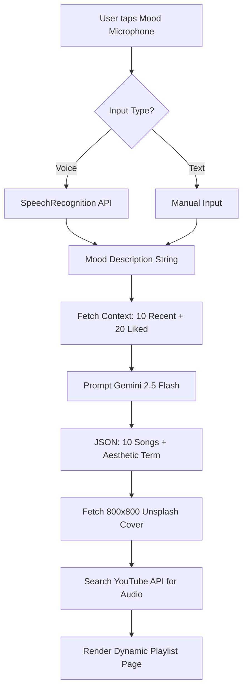
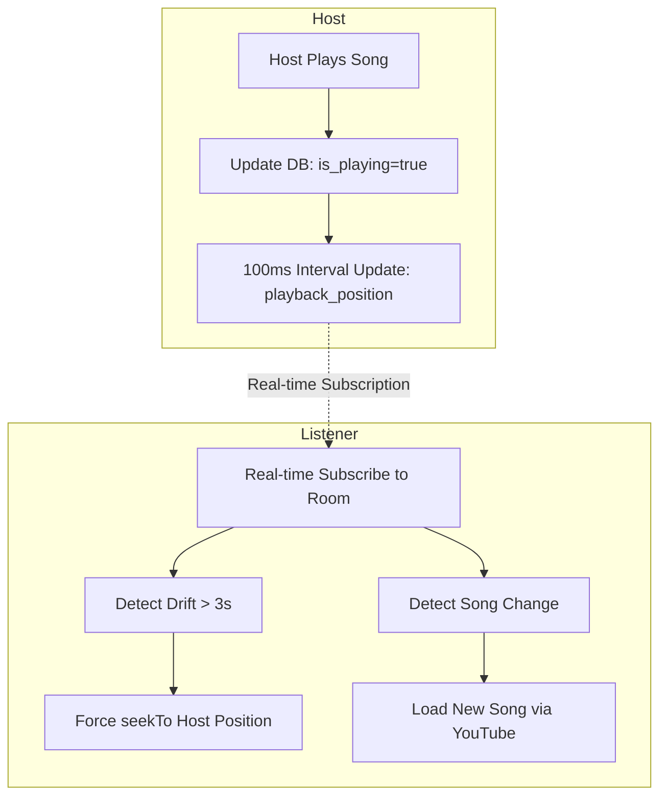

# Moodify: Project Brief

Moodify is a next-generation, AI-driven music platform that transcends traditional genre-based browsing. By leveraging advanced Large Language Models and real-time synchronization technologies, Moodify creates a deeply personal and social listening experience centered around human emotion.

---

## 🚀 The Vision
Music is inherently emotional. However, most streaming services rely on static genres or repetitive algorithms. **Moodify** changes this by allowing users to describe how they feel—in their own words or via voice—and instantly receiving a perfectly curated soundtrack for that moment.

### How We're Solving It:
1.  **AI-Native Discovery**: Instead of searching for "Lo-fi," users can say *"I'm feeling a bit overwhelmed by work and need something calming but steady to keep me focused"* and get a custom-built playlist.
2.  **Shared Presence**: The "Jam Session" feature eliminates the isolation of digital listening, allowing friends and communities to listen together in perfect sync with live chat.
3.  **Data-Driven Personalization**: The platform tracks listening habits (last 10 history items) and favorites (top 20 liked artists) to refine AI suggestions.

---

## 🎨 UI/UX Design System

Moodify follows a **Premium Modern Aesthetic** built on a strict design system defined in `index.css`.

### 1. Typography & Hierarchy
*   **Primary Typeface**: `Outfit` (sans-serif) via Google Fonts.
*   **Weight Scale**: From 300 (Light) to 900 (Black).
*   **Letter Spacing**: `-0.04em` for headings to give a tight, editorial feel; `0.05em` for uppercase meta-tags.

### 2. Color Palette & Theming
The UI supports a high-contrast Light/Dark mode with consistent terracotta/orange accents.
*   **Light Theme**:
    *   `--bg`: `#FAFAFA` (Soft White)
    *   `--text-primary`: `#18181B` (Rich Zinc)
    *   `--accent`: `#E05A33` (Terracotta)
*   **Dark Theme**:
    *   `--bg`: `#09090B` (Absolute Dark)
    *   `--text-primary`: `#FAFAFA` (Pure White)
    *   `--accent`: `#F97316` (Vibrant Orange)
*   **Glassmorphism**: `rgba(24, 24, 27, 0.75)` with `16px` backdrop blur for players and overlays.

### 3. Design Tokens (Metrics)
*   **Border Radius**: Modular scale from `8px` (sm) to `24px` (xl) for the Bento Grid.
*   **Layout Geometry**: 260px Sidebar, 320px Right Panel.
*   **Search Performance**: **300ms debounce** on real-time queries to optimize API usage.
*   **Transitions**: `0.2s` using `cubic-bezier(0.4, 0, 0.2, 1)` for all interactive elements.

---

## ✨ Core Features (Detailed)

### 1. Mood Microphone (AI Generator)
A voice-first discovery engine that acts as the platform's "Command Center."
*   **8 Defined Moods**: Optimized for `Happy`, `Chill`, `Sad`, `Workout`, `Focus`, `Party`, `Romance`, and `Hype`.
*   **Input Processing**: Uses the `SpeechRecognition API` (Webkit) for real-time transcription.
*   **Prompt Engineering**: Feeds the transcription into **Gemini 2.5 Flash**, batching precisely **10 high-relevance songs** per request.
*   **Personalization Loop**: AI queries are injected with the user's last **10 played songs** and **20 liked artists** to ensure discovery doesn't drift too far from user taste.

### 2. Dynamic Art Engine
Every AI-generated playlist receives a unique visual identity.
*   **Aesthetic Search**: Gemini returns a `coverSearchTerm` (e.g., "neon rainy street").
*   **Real-time Sourcing**: The frontend dynamically fetches a high-resolution (**800x800**) image from **Unsplash** keyed to that specific term.
*   **Atmospheric Blending**: Hero cards use these images as backgrounds with a `60% black overlay` to ensure typography remains legible.

### 3. Jam Sessions (Real-time Social)
A low-latency collaborative listening environment.
*   **Sync Logic**: A **100ms heartbeat** monitors the host's playback position.
*   **Drift Correction**: Listeners' players automatically resync if they drift more than **3 seconds** from the host.
*   **Presence Tracking**: Live listener counts and member-to-member typing indicators in the synchronized chat.

### 4. Smart Bento Dashboard
A dashboard that visualizes the user's musical identity.
*   **Data Aggregation**: Aggregates total listening time and "Top Artist" rankings derived from the full history collection.
*   **Smart Hero**: Features the last played song with a dynamic background derived from the song's `cover_url`.

---

## 🔄 Feature Workflows

### 1. AI Mood Playlist Generation

### 2. Jam Session Synchronization

---

## 🗄️ Backend Models (PocketBase)

| Collection | Description | Key Metric / Detail |
| :--- | :--- | :--- |
| `users` | Auth & Profile | Uses `ui-avatars.com` fallback if no avatar uploaded. |
| `songs` | Cached Metadata | Stores `audio_url` from YouTube to avoid redundant searches. |
| `history` | User Activity | Tracked per song; used for top artist calculation. |
| `jam_rooms` | Live Sessions | `playback_position` (float) updated every 100ms. |
| `messages` | Chat Data | TTL-style cleanup (planned) for high-traffic sessions. |
| `user_stats`| Analytics | Tracks `total_listening_time` in seconds. |

---

## 🛠️ Critical Developer Notes
*   **Collection Naming**: The main playlist collection MUST be named **`Playlist`** (capital P) for the logic in `Playlist.jsx` to function.
*   **Mood Normalization**: Mood field values must start with a **capital letter** (e.g., `Chill`) to match frontend metadata mappings.
*   **React StrictMode**: Intentionally **removed** in `main.jsx` to prevent redundant PocketBase request cancellations and race conditions during real-time subscriptions.
*   **Lyric Sync**: Uses the **LRCLIB API** for time-synced playback in the full-screen player.

---

## 🚀 Future Roadmap
*   **AI DJ Narrator**: Gemini-powered voiceovers introducing tracks with context-aware "radio style" commentary.
*   **Mood Heatmap**: A visual emotional calendar visualizing trends and sentiment shifts over a 30-day period.
*   **Karaoke Sing-Along**: Real-time synchronized lyrics with "vocal removal" technology for an immersive karaoke experience.
*   **AI Music Generation**: Integration with generative audio models (e.g., Suno/Udio) to create entirely new, royalty-free tracks on the fly based on user prompts.
*   **Zero-Latency Sync**: Moving heartbeat logic to WebSockets/PocketBase realtime hooks for sub-50ms sync in Jam Sessions.
